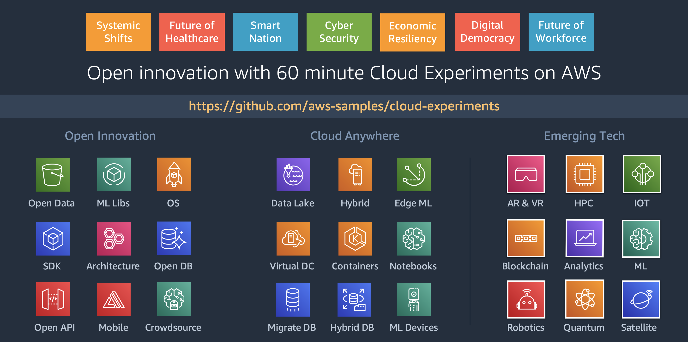

# Cloud Experiments

**Sample notebooks, starter apps, and low/no code guides for rapidly (within 60-minutes) building and running open innovation experiments on AWS Cloud**

Cloud experiments follow step-by-step workflow for performing analytics, machine learning, AI, and data science on AWS cloud. We present guidance on using AWS Cloud programmatically or visually using the console, introduce relevant AWS services, explaining the code, reviewing the code outputs, evaluating alternative steps in our workflow, and ultimately designing an abstrated reusable API for rapidly deploying these experiments on AWS cloud.

**Documentation:** [Why Cloud Experiments](https://github.com/aws-samples/cloud-experiments/tree/master/docs/why-cloud-experiments.md) | [What Are Cloud Experiments](https://github.com/aws-samples/cloud-experiments/tree/master/docs/what-are-cloud-experiments.md)

**Cloud Experiments:** [Guides](https://github.com/aws-samples/cloud-experiments#guides) | [Exploratory Data Apps](https://github.com/aws-samples/cloud-experiments#exploratory-data-apps) | [Notebooks](https://github.com/aws-samples/cloud-experiments#notebooks)

[](https://github.com/aws-samples/cloud-experiments)

## Guides

All you need to run these experiments is access to an AWS Console from your web browser.

### [Flying Cars with Glue DataBrew](https://github.com/aws-samples/cloud-experiments/tree/master/flying-cars-with-glue-databrew)

Smarter cities will have smarter transportation including multi-modal, eco-friendly, balancing commuter convenience with safety and social distancing. This 60 minute experiment uses open data for good and low/no code services provided by AWS to enable insights for business model innovation in smart transport use case. The experiment is intended as a step-by-step guided co-innovation and design workshop along with an AWS specialist. If you are familiar with the pre-requisites specified in the Cloud Experiment Guide (last section of this experiment) then feel free to make this experiment your own.

[](https://github.com/aws-samples/cloud-experiments/tree/master/flying-cars-with-glue-databrew)

## Exploratory Data Apps

We use [Streamlit](https://streamlit.io/) for many expriments in this repository. Streamlit is the fastest way to build and share data apps. Streamlit turns data scripts into shareable web apps in minutes. All in Python. All for free. No front‑end experience required.

These three steps will set you up for running experiments on your laptop.

Step 1: Setup [AWS IAM user](https://docs.aws.amazon.com/IAM/latest/UserGuide/id_users_create.html#id_users_create_console) with programmatic access.

Step 2: Install AWS Shell and configure IAM credentials.

```
pip install aws-shell
aws-shell
aws> configure
```

Step 3: Install Streamlit. Clone repo. Run app.

```
pip install streamlit
clone https://github.com/aws-samples/cloud-experiments
streamlit run cloud-experiments/open-data-explorer/s3-app.py
```

### [Open Data Explorer](https://github.com/aws-samples/cloud-experiments/tree/master/open-data-explorer)

Apps and API for exploring open data sources including [AWS Registry of Open Data](https://registry.opendata.aws/) which lists datasets for genomics, satellite, transport, COVID, medical imaging, and other use cases in data for social good.

[](https://github.com/aws-samples/cloud-experiments/tree/master/open-data-explorer)

## [COVID EDA and Models](https://github.com/aws-samples/cloud-experiments/tree/master/covid-insights)

Experiments for running exploratory data analysis (EDA) and models on COVID related open datasets. This includes Case Fatality Rate model on country data from John Hopkins. EDA techniques include growth factor analysis, cases growth rate, doubling rate, recovery and mortality rate, and country-wise analysis.

[](https://github.com/aws-samples/cloud-experiments/tree/master/covid-insights)

## Notebooks

You may want to run these notebooks using [Amazon SageMaker](https://aws.amazon.com/sagemaker/). Amazon SageMaker is a fully-managed service that covers the entire machine learning workflow to label and prepare your data, choose an algorithm, train the model, tune and optimize it for deployment, make predictions, and take action.

### [COVID Insights](https://github.com/aws-samples/cloud-experiments/tree/master/covid)

This experiment provides a catalog of open datasets for deriving insights related to COVID-19 and helping open source and open data community to collaborate in fighting this global threat. The notebook provides (a) reusable API to speed up open data analytics related to COVID-19, customized for India however can be adopted for other countries, (b) sample usage of the API, (c) documentation of insights, and (d) catalog of open datasets referenced.

### [Comprehend Medical for Electronic Health Records](https://github.com/aws-samples/cloud-experiments/tree/master/comprehend-medical-ehr)

Amazon Comprehend Medical is an API-level service which is HIPAA eligible and uses machine learning to extract medical information with high accuracy. The service eliminates the barriers to entry to access the biomedical knowledge stored in natural language text - from the research literature that entails biological processes and therapeutic mechanisms of action to the Electronic Medical Records that have the patients’ journeys through our healthcare systems documented. The service also helps us comb through that information and study relationships like symptoms, diagnosis, medication, dosage while redacting the Protected Health Information (PHI). This is an illustrative notebook that includes a step-by-step workflow for analyzing health data on the cloud.

### [Video Analytics](https://github.com/aws-samples/cloud-experiments/tree/master/video-analytics/)

Analyzing video based content requires transforming from one media format (video or audio) to another format (text or numeric) while identifying relevant structure in the resulting format. This multi-media transformation requires machine learning based recognition. Analytics libraries can work on the transformed data to determine the required outcomes including visualizations and charts. The structured data in text or numeric format can also be reused as input to training new machine learning models.

### [Using AI Services for Analyzing Public Data](https://github.com/aws-samples/cloud-experiments/tree/master/ai-services/)

So far we have been working with structured data in flat files as our data source. What if the source is images and unstructured text. AWS AI services provide vision, transcription, translation, personalization, and forecasting capabilities without the need for training and deploying machine learning models. AWS manages the machine learning complexity, you just focus on the problem at hand and send required inputs for analysis and receive output from these services within your applications.

### [Exploring data with Python and Amazon S3 Select](https://github.com/aws-samples/cloud-experiments/tree/master/exploring-data/)

For this notebook let us start with a big open dataset. Big enough that we will struggle to open it in Excel on a laptop. Excel has around million rows limit. We will setup AWS services to source from a 270GB data source, filter and store more than 8 million rows or 100 million data points into a flat file, extract schema from this file, transform this data, load into analytics tools, run Structured Query Language (SQL) on this data.

### [Optimizing data for analysis with Amazon Athena and AWS Glue](https://github.com/aws-samples/cloud-experiments/tree/master/optimizing-data/)

We will continue our open data analytics workflow starting with the AWS Console then moving to using the notebook. Using AWS Glue we can automate creating a metadata catalog based on flat files stored on Amazon S3. Glue is a fully managed extract, transform, and load (ETL) service that makes it easy for customers to prepare and load their data for analytics. You can create and run an ETL job with a few clicks in the AWS Management Console. You simply point AWS Glue to your data stored on AWS, and AWS Glue discovers your data and stores the associated metadata (e.g. table definition and schema) in the AWS Glue Data Catalog. Once cataloged, your data is immediately searchable, queryable, and available for ETL.

### [Cloudstory API](https://github.com/aws-samples/cloud-experiments/tree/master/cloudstory-api/)

Cloudstory API Python module and demo of using the API. The cloudstory API is documented in the other notebooks listed here.

## License

This library is licensed under the Apache 2.0 License. 
