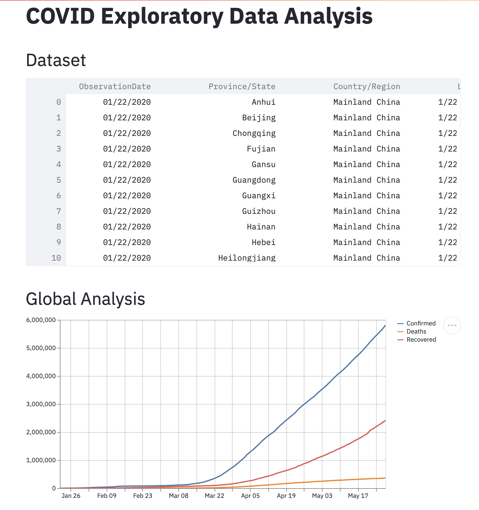

# COVID Insights

Experiments for running exploratory data analysis (EDA) and models on COVID related open datasets. This includes Case Fatality Rate model on country data from John Hopkins. EDA techniques include growth factor analysis, cases growth rate, doubling rate, recovery and mortality rate, and country-wise analysis.

Start the first experiment using `streamlit run covid-insights/cov-dash.py` to run Case Fatality Rate model directly on latest country data updated from John Hopkins repository.

Second experiment runs using `streamlit run covid-insights/covid-app.py` on archived dataset from Kaggle.

