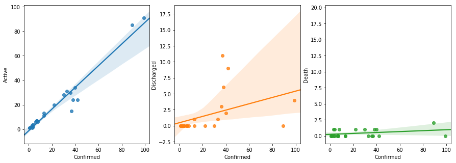

# COVID-19 Insights for India

This notebook provides a catalog of open datasets for deriving insights related to COVID-19 and helping open source and open data community to collaborate in fighting this global threat. The notebook provides (a) reusable API to speed up open data analytics related to COVID-19, customized for India however can be adopted for other countries, (b) sample usage of the API, (c) documentation of insights, and (d) catalog of open datasets referenced.

The notebook is created by aggregating content from hundreds of global contributors, whome we have tried our best to acknowledge, if you note any missed ones, please inform us by creating an issue on this Github repository. The code, links, and datasets are provided on AS-IS basis under open source. This is the work of the individual author and contributors to this repository with no endorsements from any organizations including their own.


```python
%matplotlib inline
import covid as cv
```


```python
df = cv.get_today_stats()
```

    Stats file exists: 2020-03-23-covid-india-stats.csv


```python
cv.summary_stats(df)
```


<style  type="text/css" >
    #T_93c5388e_6cbe_11ea_8546_0d05c7915f46row4_col0 {
            background-color:  pink;
        }</style><table id="T_93c5388e_6cbe_11ea_8546_0d05c7915f46" ><thead>    <tr>        <th class="blank level0" ></th>        <th class="col_heading level0 col0" >Latest</th>    </tr></thead><tbody>
                <tr>
                        <th id="T_93c5388e_6cbe_11ea_8546_0d05c7915f46level0_row0" class="row_heading level0 row0" >Indian</th>
                        <td id="T_93c5388e_6cbe_11ea_8546_0d05c7915f46row0_col0" class="data row0 col0" >319</td>
            </tr>
            <tr>
                        <th id="T_93c5388e_6cbe_11ea_8546_0d05c7915f46level0_row1" class="row_heading level0 row1" >Foreign</th>
                        <td id="T_93c5388e_6cbe_11ea_8546_0d05c7915f46row1_col0" class="data row1 col0" >41</td>
            </tr>
            <tr>
                        <th id="T_93c5388e_6cbe_11ea_8546_0d05c7915f46level0_row2" class="row_heading level0 row2" >Discharged</th>
                        <td id="T_93c5388e_6cbe_11ea_8546_0d05c7915f46row2_col0" class="data row2 col0" >24</td>
            </tr>
            <tr>
                        <th id="T_93c5388e_6cbe_11ea_8546_0d05c7915f46level0_row3" class="row_heading level0 row3" >Death</th>
                        <td id="T_93c5388e_6cbe_11ea_8546_0d05c7915f46row3_col0" class="data row3 col0" >7</td>
            </tr>
            <tr>
                        <th id="T_93c5388e_6cbe_11ea_8546_0d05c7915f46level0_row4" class="row_heading level0 row4" >Confirmed</th>
                        <td id="T_93c5388e_6cbe_11ea_8546_0d05c7915f46row4_col0" class="data row4 col0" >391</td>
            </tr>
            <tr>
                        <th id="T_93c5388e_6cbe_11ea_8546_0d05c7915f46level0_row5" class="row_heading level0 row5" >Active</th>
                        <td id="T_93c5388e_6cbe_11ea_8546_0d05c7915f46row5_col0" class="data row5 col0" >329</td>
            </tr>
    </tbody></table>


```python
cv.display_stats(df)
```


<style  type="text/css" >
    #T_96b14ef2_6cbe_11ea_8546_0d05c7915f46row0_col1 {
            background-color:  pink;
        }    #T_96b14ef2_6cbe_11ea_8546_0d05c7915f46row0_col4 {
            background-color:  pink;
        }    #T_96b14ef2_6cbe_11ea_8546_0d05c7915f46row0_col5 {
            background-color:  pink;
        }    #T_96b14ef2_6cbe_11ea_8546_0d05c7915f46row0_col6 {
            background-color:  pink;
        }    #T_96b14ef2_6cbe_11ea_8546_0d05c7915f46row4_col2 {
            background-color:  pink;
        }    #T_96b14ef2_6cbe_11ea_8546_0d05c7915f46row8_col3 {
            background-color:  pink;
        }</style><table id="T_96b14ef2_6cbe_11ea_8546_0d05c7915f46" ><thead>    <tr>        <th class="blank level0" ></th>        <th class="col_heading level0 col0" >State</th>        <th class="col_heading level0 col1" >Indian</th>        <th class="col_heading level0 col2" >Foreign</th>        <th class="col_heading level0 col3" >Discharged</th>        <th class="col_heading level0 col4" >Death</th>        <th class="col_heading level0 col5" >Confirmed</th>        <th class="col_heading level0 col6" >Active</th>    </tr></thead><tbody>
                <tr>
                        <th id="T_96b14ef2_6cbe_11ea_8546_0d05c7915f46level0_row0" class="row_heading level0 row0" >10</th>
                        <td id="T_96b14ef2_6cbe_11ea_8546_0d05c7915f46row0_col0" class="data row0 col0" >Maharashtra</td>
                        <td id="T_96b14ef2_6cbe_11ea_8546_0d05c7915f46row0_col1" class="data row0 col1" >64</td>
                        <td id="T_96b14ef2_6cbe_11ea_8546_0d05c7915f46row0_col2" class="data row0 col2" >3</td>
                        <td id="T_96b14ef2_6cbe_11ea_8546_0d05c7915f46row0_col3" class="data row0 col3" >0</td>
                        <td id="T_96b14ef2_6cbe_11ea_8546_0d05c7915f46row0_col4" class="data row0 col4" >2</td>
                        <td id="T_96b14ef2_6cbe_11ea_8546_0d05c7915f46row0_col5" class="data row0 col5" >69</td>
                        <td id="T_96b14ef2_6cbe_11ea_8546_0d05c7915f46row0_col6" class="data row0 col6" >65</td>
            </tr>
            <tr>
                        <th id="T_96b14ef2_6cbe_11ea_8546_0d05c7915f46level0_row1" class="row_heading level0 row1" >8</th>
                        <td id="T_96b14ef2_6cbe_11ea_8546_0d05c7915f46row1_col0" class="data row1 col0" >Kerala</td>
                        <td id="T_96b14ef2_6cbe_11ea_8546_0d05c7915f46row1_col1" class="data row1 col1" >45</td>
                        <td id="T_96b14ef2_6cbe_11ea_8546_0d05c7915f46row1_col2" class="data row1 col2" >7</td>
                        <td id="T_96b14ef2_6cbe_11ea_8546_0d05c7915f46row1_col3" class="data row1 col3" >3</td>
                        <td id="T_96b14ef2_6cbe_11ea_8546_0d05c7915f46row1_col4" class="data row1 col4" >0</td>
                        <td id="T_96b14ef2_6cbe_11ea_8546_0d05c7915f46row1_col5" class="data row1 col5" >55</td>
                        <td id="T_96b14ef2_6cbe_11ea_8546_0d05c7915f46row1_col6" class="data row1 col6" >49</td>
            </tr>
            <tr>
                        <th id="T_96b14ef2_6cbe_11ea_8546_0d05c7915f46level0_row2" class="row_heading level0 row2" >3</th>
                        <td id="T_96b14ef2_6cbe_11ea_8546_0d05c7915f46row2_col0" class="data row2 col0" >Delhi</td>
                        <td id="T_96b14ef2_6cbe_11ea_8546_0d05c7915f46row2_col1" class="data row2 col1" >28</td>
                        <td id="T_96b14ef2_6cbe_11ea_8546_0d05c7915f46row2_col2" class="data row2 col2" >1</td>
                        <td id="T_96b14ef2_6cbe_11ea_8546_0d05c7915f46row2_col3" class="data row2 col3" >5</td>
                        <td id="T_96b14ef2_6cbe_11ea_8546_0d05c7915f46row2_col4" class="data row2 col4" >1</td>
                        <td id="T_96b14ef2_6cbe_11ea_8546_0d05c7915f46row2_col5" class="data row2 col5" >35</td>
                        <td id="T_96b14ef2_6cbe_11ea_8546_0d05c7915f46row2_col6" class="data row2 col6" >23</td>
            </tr>
            <tr>
                        <th id="T_96b14ef2_6cbe_11ea_8546_0d05c7915f46level0_row3" class="row_heading level0 row3" >7</th>
                        <td id="T_96b14ef2_6cbe_11ea_8546_0d05c7915f46row3_col0" class="data row3 col0" >Karnataka</td>
                        <td id="T_96b14ef2_6cbe_11ea_8546_0d05c7915f46row3_col1" class="data row3 col1" >26</td>
                        <td id="T_96b14ef2_6cbe_11ea_8546_0d05c7915f46row3_col2" class="data row3 col2" >0</td>
                        <td id="T_96b14ef2_6cbe_11ea_8546_0d05c7915f46row3_col3" class="data row3 col3" >2</td>
                        <td id="T_96b14ef2_6cbe_11ea_8546_0d05c7915f46row3_col4" class="data row3 col4" >1</td>
                        <td id="T_96b14ef2_6cbe_11ea_8546_0d05c7915f46row3_col5" class="data row3 col5" >29</td>
                        <td id="T_96b14ef2_6cbe_11ea_8546_0d05c7915f46row3_col6" class="data row3 col6" >23</td>
            </tr>
            <tr>
                        <th id="T_96b14ef2_6cbe_11ea_8546_0d05c7915f46level0_row4" class="row_heading level0 row4" >5</th>
                        <td id="T_96b14ef2_6cbe_11ea_8546_0d05c7915f46row4_col0" class="data row4 col0" >Haryana</td>
                        <td id="T_96b14ef2_6cbe_11ea_8546_0d05c7915f46row4_col1" class="data row4 col1" >7</td>
                        <td id="T_96b14ef2_6cbe_11ea_8546_0d05c7915f46row4_col2" class="data row4 col2" >14</td>
                        <td id="T_96b14ef2_6cbe_11ea_8546_0d05c7915f46row4_col3" class="data row4 col3" >0</td>
                        <td id="T_96b14ef2_6cbe_11ea_8546_0d05c7915f46row4_col4" class="data row4 col4" >0</td>
                        <td id="T_96b14ef2_6cbe_11ea_8546_0d05c7915f46row4_col5" class="data row4 col5" >21</td>
                        <td id="T_96b14ef2_6cbe_11ea_8546_0d05c7915f46row4_col6" class="data row4 col6" >21</td>
            </tr>
            <tr>
                        <th id="T_96b14ef2_6cbe_11ea_8546_0d05c7915f46level0_row5" class="row_heading level0 row5" >16</th>
                        <td id="T_96b14ef2_6cbe_11ea_8546_0d05c7915f46row5_col0" class="data row5 col0" >Telengana</td>
                        <td id="T_96b14ef2_6cbe_11ea_8546_0d05c7915f46row5_col1" class="data row5 col1" >11</td>
                        <td id="T_96b14ef2_6cbe_11ea_8546_0d05c7915f46row5_col2" class="data row5 col2" >11</td>
                        <td id="T_96b14ef2_6cbe_11ea_8546_0d05c7915f46row5_col3" class="data row5 col3" >1</td>
                        <td id="T_96b14ef2_6cbe_11ea_8546_0d05c7915f46row5_col4" class="data row5 col4" >0</td>
                        <td id="T_96b14ef2_6cbe_11ea_8546_0d05c7915f46row5_col5" class="data row5 col5" >23</td>
                        <td id="T_96b14ef2_6cbe_11ea_8546_0d05c7915f46row5_col6" class="data row5 col6" >21</td>
            </tr>
            <tr>
                        <th id="T_96b14ef2_6cbe_11ea_8546_0d05c7915f46level0_row6" class="row_heading level0 row6" >14</th>
                        <td id="T_96b14ef2_6cbe_11ea_8546_0d05c7915f46row6_col0" class="data row6 col0" >Rajasthan</td>
                        <td id="T_96b14ef2_6cbe_11ea_8546_0d05c7915f46row6_col1" class="data row6 col1" >22</td>
                        <td id="T_96b14ef2_6cbe_11ea_8546_0d05c7915f46row6_col2" class="data row6 col2" >2</td>
                        <td id="T_96b14ef2_6cbe_11ea_8546_0d05c7915f46row6_col3" class="data row6 col3" >3</td>
                        <td id="T_96b14ef2_6cbe_11ea_8546_0d05c7915f46row6_col4" class="data row6 col4" >0</td>
                        <td id="T_96b14ef2_6cbe_11ea_8546_0d05c7915f46row6_col5" class="data row6 col5" >27</td>
                        <td id="T_96b14ef2_6cbe_11ea_8546_0d05c7915f46row6_col6" class="data row6 col6" >21</td>
            </tr>
            <tr>
                        <th id="T_96b14ef2_6cbe_11ea_8546_0d05c7915f46level0_row7" class="row_heading level0 row7" >13</th>
                        <td id="T_96b14ef2_6cbe_11ea_8546_0d05c7915f46row7_col0" class="data row7 col0" >Punjab</td>
                        <td id="T_96b14ef2_6cbe_11ea_8546_0d05c7915f46row7_col1" class="data row7 col1" >21</td>
                        <td id="T_96b14ef2_6cbe_11ea_8546_0d05c7915f46row7_col2" class="data row7 col2" >0</td>
                        <td id="T_96b14ef2_6cbe_11ea_8546_0d05c7915f46row7_col3" class="data row7 col3" >0</td>
                        <td id="T_96b14ef2_6cbe_11ea_8546_0d05c7915f46row7_col4" class="data row7 col4" >1</td>
                        <td id="T_96b14ef2_6cbe_11ea_8546_0d05c7915f46row7_col5" class="data row7 col5" >22</td>
                        <td id="T_96b14ef2_6cbe_11ea_8546_0d05c7915f46row7_col6" class="data row7 col6" >20</td>
            </tr>
            <tr>
                        <th id="T_96b14ef2_6cbe_11ea_8546_0d05c7915f46level0_row8" class="row_heading level0 row8" >20</th>
                        <td id="T_96b14ef2_6cbe_11ea_8546_0d05c7915f46row8_col0" class="data row8 col0" >Uttar Pradesh</td>
                        <td id="T_96b14ef2_6cbe_11ea_8546_0d05c7915f46row8_col1" class="data row8 col1" >26</td>
                        <td id="T_96b14ef2_6cbe_11ea_8546_0d05c7915f46row8_col2" class="data row8 col2" >1</td>
                        <td id="T_96b14ef2_6cbe_11ea_8546_0d05c7915f46row8_col3" class="data row8 col3" >9</td>
                        <td id="T_96b14ef2_6cbe_11ea_8546_0d05c7915f46row8_col4" class="data row8 col4" >0</td>
                        <td id="T_96b14ef2_6cbe_11ea_8546_0d05c7915f46row8_col5" class="data row8 col5" >36</td>
                        <td id="T_96b14ef2_6cbe_11ea_8546_0d05c7915f46row8_col6" class="data row8 col6" >18</td>
            </tr>
            <tr>
                        <th id="T_96b14ef2_6cbe_11ea_8546_0d05c7915f46level0_row9" class="row_heading level0 row9" >4</th>
                        <td id="T_96b14ef2_6cbe_11ea_8546_0d05c7915f46row9_col0" class="data row9 col0" >Gujarat</td>
                        <td id="T_96b14ef2_6cbe_11ea_8546_0d05c7915f46row9_col1" class="data row9 col1" >18</td>
                        <td id="T_96b14ef2_6cbe_11ea_8546_0d05c7915f46row9_col2" class="data row9 col2" >0</td>
                        <td id="T_96b14ef2_6cbe_11ea_8546_0d05c7915f46row9_col3" class="data row9 col3" >0</td>
                        <td id="T_96b14ef2_6cbe_11ea_8546_0d05c7915f46row9_col4" class="data row9 col4" >1</td>
                        <td id="T_96b14ef2_6cbe_11ea_8546_0d05c7915f46row9_col5" class="data row9 col5" >19</td>
                        <td id="T_96b14ef2_6cbe_11ea_8546_0d05c7915f46row9_col6" class="data row9 col6" >17</td>
            </tr>
            <tr>
                        <th id="T_96b14ef2_6cbe_11ea_8546_0d05c7915f46level0_row10" class="row_heading level0 row10" >19</th>
                        <td id="T_96b14ef2_6cbe_11ea_8546_0d05c7915f46row10_col0" class="data row10 col0" >Ladakh</td>
                        <td id="T_96b14ef2_6cbe_11ea_8546_0d05c7915f46row10_col1" class="data row10 col1" >13</td>
                        <td id="T_96b14ef2_6cbe_11ea_8546_0d05c7915f46row10_col2" class="data row10 col2" >0</td>
                        <td id="T_96b14ef2_6cbe_11ea_8546_0d05c7915f46row10_col3" class="data row10 col3" >0</td>
                        <td id="T_96b14ef2_6cbe_11ea_8546_0d05c7915f46row10_col4" class="data row10 col4" >0</td>
                        <td id="T_96b14ef2_6cbe_11ea_8546_0d05c7915f46row10_col5" class="data row10 col5" >13</td>
                        <td id="T_96b14ef2_6cbe_11ea_8546_0d05c7915f46row10_col6" class="data row10 col6" >13</td>
            </tr>
            <tr>
                        <th id="T_96b14ef2_6cbe_11ea_8546_0d05c7915f46level0_row11" class="row_heading level0 row11" >15</th>
                        <td id="T_96b14ef2_6cbe_11ea_8546_0d05c7915f46row11_col0" class="data row11 col0" >Tamil Nadu</td>
                        <td id="T_96b14ef2_6cbe_11ea_8546_0d05c7915f46row11_col1" class="data row11 col1" >5</td>
                        <td id="T_96b14ef2_6cbe_11ea_8546_0d05c7915f46row11_col2" class="data row11 col2" >2</td>
                        <td id="T_96b14ef2_6cbe_11ea_8546_0d05c7915f46row11_col3" class="data row11 col3" >1</td>
                        <td id="T_96b14ef2_6cbe_11ea_8546_0d05c7915f46row11_col4" class="data row11 col4" >0</td>
                        <td id="T_96b14ef2_6cbe_11ea_8546_0d05c7915f46row11_col5" class="data row11 col5" >8</td>
                        <td id="T_96b14ef2_6cbe_11ea_8546_0d05c7915f46row11_col6" class="data row11 col6" >6</td>
            </tr>
            <tr>
                        <th id="T_96b14ef2_6cbe_11ea_8546_0d05c7915f46level0_row12" class="row_heading level0 row12" >0</th>
                        <td id="T_96b14ef2_6cbe_11ea_8546_0d05c7915f46row12_col0" class="data row12 col0" >Andhra Pradesh</td>
                        <td id="T_96b14ef2_6cbe_11ea_8546_0d05c7915f46row12_col1" class="data row12 col1" >5</td>
                        <td id="T_96b14ef2_6cbe_11ea_8546_0d05c7915f46row12_col2" class="data row12 col2" >0</td>
                        <td id="T_96b14ef2_6cbe_11ea_8546_0d05c7915f46row12_col3" class="data row12 col3" >0</td>
                        <td id="T_96b14ef2_6cbe_11ea_8546_0d05c7915f46row12_col4" class="data row12 col4" >0</td>
                        <td id="T_96b14ef2_6cbe_11ea_8546_0d05c7915f46row12_col5" class="data row12 col5" >5</td>
                        <td id="T_96b14ef2_6cbe_11ea_8546_0d05c7915f46row12_col6" class="data row12 col6" >5</td>
            </tr>
            <tr>
                        <th id="T_96b14ef2_6cbe_11ea_8546_0d05c7915f46level0_row13" class="row_heading level0 row13" >17</th>
                        <td id="T_96b14ef2_6cbe_11ea_8546_0d05c7915f46row13_col0" class="data row13 col0" >Chandigarh</td>
                        <td id="T_96b14ef2_6cbe_11ea_8546_0d05c7915f46row13_col1" class="data row13 col1" >5</td>
                        <td id="T_96b14ef2_6cbe_11ea_8546_0d05c7915f46row13_col2" class="data row13 col2" >0</td>
                        <td id="T_96b14ef2_6cbe_11ea_8546_0d05c7915f46row13_col3" class="data row13 col3" >0</td>
                        <td id="T_96b14ef2_6cbe_11ea_8546_0d05c7915f46row13_col4" class="data row13 col4" >0</td>
                        <td id="T_96b14ef2_6cbe_11ea_8546_0d05c7915f46row13_col5" class="data row13 col5" >5</td>
                        <td id="T_96b14ef2_6cbe_11ea_8546_0d05c7915f46row13_col6" class="data row13 col6" >5</td>
            </tr>
            <tr>
                        <th id="T_96b14ef2_6cbe_11ea_8546_0d05c7915f46level0_row14" class="row_heading level0 row14" >18</th>
                        <td id="T_96b14ef2_6cbe_11ea_8546_0d05c7915f46row14_col0" class="data row14 col0" >Jammu and Kashmir</td>
                        <td id="T_96b14ef2_6cbe_11ea_8546_0d05c7915f46row14_col1" class="data row14 col1" >4</td>
                        <td id="T_96b14ef2_6cbe_11ea_8546_0d05c7915f46row14_col2" class="data row14 col2" >0</td>
                        <td id="T_96b14ef2_6cbe_11ea_8546_0d05c7915f46row14_col3" class="data row14 col3" >0</td>
                        <td id="T_96b14ef2_6cbe_11ea_8546_0d05c7915f46row14_col4" class="data row14 col4" >0</td>
                        <td id="T_96b14ef2_6cbe_11ea_8546_0d05c7915f46row14_col5" class="data row14 col5" >4</td>
                        <td id="T_96b14ef2_6cbe_11ea_8546_0d05c7915f46row14_col6" class="data row14 col6" >4</td>
            </tr>
            <tr>
                        <th id="T_96b14ef2_6cbe_11ea_8546_0d05c7915f46level0_row15" class="row_heading level0 row15" >22</th>
                        <td id="T_96b14ef2_6cbe_11ea_8546_0d05c7915f46row15_col0" class="data row15 col0" >West Bengal</td>
                        <td id="T_96b14ef2_6cbe_11ea_8546_0d05c7915f46row15_col1" class="data row15 col1" >4</td>
                        <td id="T_96b14ef2_6cbe_11ea_8546_0d05c7915f46row15_col2" class="data row15 col2" >0</td>
                        <td id="T_96b14ef2_6cbe_11ea_8546_0d05c7915f46row15_col3" class="data row15 col3" >0</td>
                        <td id="T_96b14ef2_6cbe_11ea_8546_0d05c7915f46row15_col4" class="data row15 col4" >0</td>
                        <td id="T_96b14ef2_6cbe_11ea_8546_0d05c7915f46row15_col5" class="data row15 col5" >4</td>
                        <td id="T_96b14ef2_6cbe_11ea_8546_0d05c7915f46row15_col6" class="data row15 col6" >4</td>
            </tr>
            <tr>
                        <th id="T_96b14ef2_6cbe_11ea_8546_0d05c7915f46level0_row16" class="row_heading level0 row16" >9</th>
                        <td id="T_96b14ef2_6cbe_11ea_8546_0d05c7915f46row16_col0" class="data row16 col0" >Madhya Pradesh</td>
                        <td id="T_96b14ef2_6cbe_11ea_8546_0d05c7915f46row16_col1" class="data row16 col1" >4</td>
                        <td id="T_96b14ef2_6cbe_11ea_8546_0d05c7915f46row16_col2" class="data row16 col2" >0</td>
                        <td id="T_96b14ef2_6cbe_11ea_8546_0d05c7915f46row16_col3" class="data row16 col3" >0</td>
                        <td id="T_96b14ef2_6cbe_11ea_8546_0d05c7915f46row16_col4" class="data row16 col4" >0</td>
                        <td id="T_96b14ef2_6cbe_11ea_8546_0d05c7915f46row16_col5" class="data row16 col5" >4</td>
                        <td id="T_96b14ef2_6cbe_11ea_8546_0d05c7915f46row16_col6" class="data row16 col6" >4</td>
            </tr>
            <tr>
                        <th id="T_96b14ef2_6cbe_11ea_8546_0d05c7915f46level0_row17" class="row_heading level0 row17" >21</th>
                        <td id="T_96b14ef2_6cbe_11ea_8546_0d05c7915f46row17_col0" class="data row17 col0" >Uttarakhand</td>
                        <td id="T_96b14ef2_6cbe_11ea_8546_0d05c7915f46row17_col1" class="data row17 col1" >3</td>
                        <td id="T_96b14ef2_6cbe_11ea_8546_0d05c7915f46row17_col2" class="data row17 col2" >0</td>
                        <td id="T_96b14ef2_6cbe_11ea_8546_0d05c7915f46row17_col3" class="data row17 col3" >0</td>
                        <td id="T_96b14ef2_6cbe_11ea_8546_0d05c7915f46row17_col4" class="data row17 col4" >0</td>
                        <td id="T_96b14ef2_6cbe_11ea_8546_0d05c7915f46row17_col5" class="data row17 col5" >3</td>
                        <td id="T_96b14ef2_6cbe_11ea_8546_0d05c7915f46row17_col6" class="data row17 col6" >3</td>
            </tr>
            <tr>
                        <th id="T_96b14ef2_6cbe_11ea_8546_0d05c7915f46level0_row18" class="row_heading level0 row18" >6</th>
                        <td id="T_96b14ef2_6cbe_11ea_8546_0d05c7915f46row18_col0" class="data row18 col0" >Himachal Pradesh</td>
                        <td id="T_96b14ef2_6cbe_11ea_8546_0d05c7915f46row18_col1" class="data row18 col1" >2</td>
                        <td id="T_96b14ef2_6cbe_11ea_8546_0d05c7915f46row18_col2" class="data row18 col2" >0</td>
                        <td id="T_96b14ef2_6cbe_11ea_8546_0d05c7915f46row18_col3" class="data row18 col3" >0</td>
                        <td id="T_96b14ef2_6cbe_11ea_8546_0d05c7915f46row18_col4" class="data row18 col4" >0</td>
                        <td id="T_96b14ef2_6cbe_11ea_8546_0d05c7915f46row18_col5" class="data row18 col5" >2</td>
                        <td id="T_96b14ef2_6cbe_11ea_8546_0d05c7915f46row18_col6" class="data row18 col6" >2</td>
            </tr>
            <tr>
                        <th id="T_96b14ef2_6cbe_11ea_8546_0d05c7915f46level0_row19" class="row_heading level0 row19" >11</th>
                        <td id="T_96b14ef2_6cbe_11ea_8546_0d05c7915f46row19_col0" class="data row19 col0" >Odisha</td>
                        <td id="T_96b14ef2_6cbe_11ea_8546_0d05c7915f46row19_col1" class="data row19 col1" >2</td>
                        <td id="T_96b14ef2_6cbe_11ea_8546_0d05c7915f46row19_col2" class="data row19 col2" >0</td>
                        <td id="T_96b14ef2_6cbe_11ea_8546_0d05c7915f46row19_col3" class="data row19 col3" >0</td>
                        <td id="T_96b14ef2_6cbe_11ea_8546_0d05c7915f46row19_col4" class="data row19 col4" >0</td>
                        <td id="T_96b14ef2_6cbe_11ea_8546_0d05c7915f46row19_col5" class="data row19 col5" >2</td>
                        <td id="T_96b14ef2_6cbe_11ea_8546_0d05c7915f46row19_col6" class="data row19 col6" >2</td>
            </tr>
            <tr>
                        <th id="T_96b14ef2_6cbe_11ea_8546_0d05c7915f46level0_row20" class="row_heading level0 row20" >12</th>
                        <td id="T_96b14ef2_6cbe_11ea_8546_0d05c7915f46row20_col0" class="data row20 col0" >Puducherry</td>
                        <td id="T_96b14ef2_6cbe_11ea_8546_0d05c7915f46row20_col1" class="data row20 col1" >1</td>
                        <td id="T_96b14ef2_6cbe_11ea_8546_0d05c7915f46row20_col2" class="data row20 col2" >0</td>
                        <td id="T_96b14ef2_6cbe_11ea_8546_0d05c7915f46row20_col3" class="data row20 col3" >0</td>
                        <td id="T_96b14ef2_6cbe_11ea_8546_0d05c7915f46row20_col4" class="data row20 col4" >0</td>
                        <td id="T_96b14ef2_6cbe_11ea_8546_0d05c7915f46row20_col5" class="data row20 col5" >1</td>
                        <td id="T_96b14ef2_6cbe_11ea_8546_0d05c7915f46row20_col6" class="data row20 col6" >1</td>
            </tr>
            <tr>
                        <th id="T_96b14ef2_6cbe_11ea_8546_0d05c7915f46level0_row21" class="row_heading level0 row21" >1</th>
                        <td id="T_96b14ef2_6cbe_11ea_8546_0d05c7915f46row21_col0" class="data row21 col0" >Bihar</td>
                        <td id="T_96b14ef2_6cbe_11ea_8546_0d05c7915f46row21_col1" class="data row21 col1" >2</td>
                        <td id="T_96b14ef2_6cbe_11ea_8546_0d05c7915f46row21_col2" class="data row21 col2" >0</td>
                        <td id="T_96b14ef2_6cbe_11ea_8546_0d05c7915f46row21_col3" class="data row21 col3" >0</td>
                        <td id="T_96b14ef2_6cbe_11ea_8546_0d05c7915f46row21_col4" class="data row21 col4" >1</td>
                        <td id="T_96b14ef2_6cbe_11ea_8546_0d05c7915f46row21_col5" class="data row21 col5" >3</td>
                        <td id="T_96b14ef2_6cbe_11ea_8546_0d05c7915f46row21_col6" class="data row21 col6" >1</td>
            </tr>
            <tr>
                        <th id="T_96b14ef2_6cbe_11ea_8546_0d05c7915f46level0_row22" class="row_heading level0 row22" >2</th>
                        <td id="T_96b14ef2_6cbe_11ea_8546_0d05c7915f46row22_col0" class="data row22 col0" >Chhattisgarh</td>
                        <td id="T_96b14ef2_6cbe_11ea_8546_0d05c7915f46row22_col1" class="data row22 col1" >1</td>
                        <td id="T_96b14ef2_6cbe_11ea_8546_0d05c7915f46row22_col2" class="data row22 col2" >0</td>
                        <td id="T_96b14ef2_6cbe_11ea_8546_0d05c7915f46row22_col3" class="data row22 col3" >0</td>
                        <td id="T_96b14ef2_6cbe_11ea_8546_0d05c7915f46row22_col4" class="data row22 col4" >0</td>
                        <td id="T_96b14ef2_6cbe_11ea_8546_0d05c7915f46row22_col5" class="data row22 col5" >1</td>
                        <td id="T_96b14ef2_6cbe_11ea_8546_0d05c7915f46row22_col6" class="data row22 col6" >1</td>
            </tr>
    </tbody></table>


```python
cv.linear_regression(df)
```





### COVID-19 Open Datasets


#### India Stats

1. [Ministry of Health and Family Welfare - MOHFW](https://www.mohfw.gov.in/) publishes COVID India stats. This notebook pulls the stats from HTML table on site.

#### India Dashboards

1. Kiprosh [covidout.in dashboard](https://covidout.in/) provides MOHFW stats, daily and cummulative trends.


#### Global Stats

1. [Geographic distribution of COVID-19 cases worldwide](https://www.ecdc.europa.eu/en/publications-data/download-todays-data-geographic-distribution-covid-19-cases-worldwide) from European Centre for Disease Prevention and Control available as daily [Excel dataset](https://www.ecdc.europa.eu/sites/default/files/documents/COVID-19-geographic-disbtribution-worldwide-2020-03-22.xlsx) (2020-03-22). Replace yyyy-mm-dd suffix on file to get historical/current data.

2. Johns Hopkins University [Global Dashboard](https://gisanddata.maps.arcgis.com/apps/opsdashboard/index.html#/bda7594740fd40299423467b48e9ecf6) and GitHub [datasets](https://github.com/CSSEGISandData/COVID-19).

3. Situational Awareness Dashboard from [World Health Organization](https://experience.arcgis.com/experience/685d0ace521648f8a5beeeee1b9125cd).

#### India Hospitals, Testing Labs

1. [ICMR](https://icmr.nic.in/what-s-new) List of Government [Laboratories](https://icmr.nic.in/sites/default/files/upload_documents/Govt_Lab_COVID_19_Testing_V2.pdf) for COVID-19 Testing

2. Statewise Hospital Beds from [PIB](https://pib.gov.in/PressReleasePage.aspx?PRID=1539877) extracted to [CSV dataset](https://www.kaggle.com/sudalairajkumar/covid19-in-india#HospitalBedsIndia.csv) on Kaggle.

#### Census, Demographics

1. India rural, urban population and area by states on [Wikipedia](https://en.wikipedia.org/wiki/List_of_states_and_union_territories_of_India_by_population) extracted to [CSV dataset](https://www.kaggle.com/sudalairajkumar/covid19-in-india#population_india_census2011.csv) on Kaggle.

2. [World Bank Indicators](https://data.humdata.org/dataset/world-bank-indicators-of-interest-to-the-covid-19-outbreak) of Interest to the COVID-19 Outbreak.

#### Research

1. COVID-19 [Open Research Dataset](https://pages.semanticscholar.org/coronavirus-research) (CORD-19) from  Allen Institute for AI. Contains over 44,000 scholarly articles, including over 29,000 with full text, about COVID-19 and the coronavirus family of viruses for use by the global research community.

#### News Analysis

1. ACAPS COVID-19: [Government Measures Dataset](https://data.humdata.org/dataset/acaps-covid19-government-measures-dataset)

#### Notebooks

1. Notebook from Parul Pandey on [Tracking India's Coronavirus Spread](https://www.kaggle.com/parulpandey/tracking-india-s-coronavirus-spread-wip/notebook) compares trends across India, Italy, Korea.

#### Meta Dataset Sources

1. [Registry of Open Data on AWS](https://registry.opendata.aws/)

2. [MyGov COVID-19 Solution Challenge / Resources](https://innovate.mygov.in/covid19/#tab6)

3. [Covidout Data Sources](https://covidout.in/sources)

4. [Kaggle COVID datasets](https://www.kaggle.com/search?q=covid+coronavirus+in%3Adatasets)

