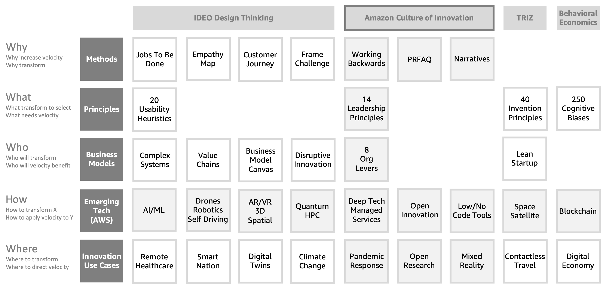

# Why Cloud Experiments

What's not going to change in the next 10 years? This question led to the Amazon virtuous cycle or flywheel focusing on value, convenience, and selection. If we ask this question today to organisations who are thinking about the new normal post pandemic, the answer may include – velocity – the speed of something in a given direction. Organisations want to deliver outcomes faster. They want to complete their physical to digital journey in less time. They want to build new products and services with faster time to market. During the 2020 pandemic, the whole world woke up to the importance of high velocity change in every aspect of our lives from travel to work, from social interactions to how we teach our kids. Reacting faster to change saved lives. Velocity enables organisations to run more experiments. More experiments translate into more innovation. 

>Further reading: [Jeff Bezos on Planning for the Future in Uncertain Times](https://www.inc.com/jason-aten/with-this-simple-3-word-question-jeff-bezos-explains-how-to-plan-for-future-despite-turbulent-times.html), Inc. Magazine | [Amazon Virtuous Cycle](https://www.youtube.com/watch?v=NJ1-ufRs57E): Fireside Chat with Jeff Wilke of Amazon

In fact, there is another answer to the 10-years question. This time it is the word – transform – to make a marked change in the form, nature, or appearance of. You can use this verb in a technical context like Extract Transform Load (ETL), which is what AWS Glue does for data. It extracts data from a source in a certain format, like log files; transforms this data into desired form; then loads it for intended outcomes, like into Amazon QuickSight for insights like outlier detection. Transforms play an important role in many AWS services. AWS Transcribe transforms speech to text while Amazon Polly does the reverse. AWS Glue DataBrew can apply 250 pre-built transforms to automate data preparation tasks for machine learning and analytics workloads. Amazon Sumerian can transform 3D polygons into virtual reality worlds. Transforms are everywhere. Business models also transform, from brick-and-mortar to online, from cash to digital payments, and from business-to-consumer to peer-to-peer. Applying transforms is synonymous to running experiments on business models, data, processes, and customer journeys.

>We hypothesize that, when we perform technology transforms with speed, enabling business models to transform from existing state to a new direction, we achieve high velocity innovation.	

Uber uses high velocity innovation to transform user location, city maps, and cab network into a real-time cab booking experience enabling a peer-to-peer business model. Amazons uses high velocity innovation to transform hundreds of millions of SKUs within its product catalog and hundreds of millions of user carts into real-time recommendations, enabling a personalised online shopping business model. The ultimate aspiration for high velocity innovation is to achieve real-time experience for the business and the customer. It is hard work, Amazon took 25 years of peculiar innovation culture to get there. Today, Amazon deploys changes to its software applications 194 million times in a year. As Amazon business model is driven by these applications, it is not incorrect to say that Amazon business model transforms six times every second! Now that is real-time.

>We expand on our hypothesis. Customer context transforms to delight with a series of technology enabled transforms on business models, equipment or devices, people skills and organisation, events, processes, and data, along the direction of the customer journey, every transform aiming to improve speed in the direction of achieving customer delight. This results in high velocity innovation for the organisation.

Uber and Amazon are cited as case studies of disruptive innovation. There are three more types of innovation. Greg Satell in his book titled Mapping Innovation and the Harvard Business Review article  on the topic defines four types of innovation and problems they solve. Basic research or incremental innovation is suitable when problem and domain are not well defined. This type of innovation engages academic partnerships, research divisions, journals, and conferences. Disruptive innovation is applicable when domain is well defined however problem is not. This innovation technique engages VC model, innovation labs, 15%/20% rule  to block time for creative pursuits or passion projects instead of day job, and lean launchpad . Breakthrough or radical innovation is best used when problem is well defined but domain is not. This technique requires mavericks, skunk works, and open innovation/prizes according to Satell. When both problem and domain are well defined we choose sustaining innovation technique which requires design thinking, roadmapping, R&D labs, and acquisitions to achieve solutions. Cloud Experiments can support disruptive innovation (using open innovation), radical innovation (with communities of practice), and sustaining innovation.

Cloud Experiments tell exploratory innovation stories. Stories inspire call to action and can present a complex theory in a user friendly manner. Several design thinking methods tell stories to enable ideation. Now imagine bringing these stories to life with real-world datasets, embedded visualisations, and interactive apps. New York Times does a great job of combining data and journalism into interactive storytelling with their series  on 2020 year in graphics. Guardian Data Journalism  is another example of telling thought provoking stories with interactive data visualisations. Well known for its product innovation and design, Apple has been using visuals, animations, data, and narrative to explain technical specifications  of their products for years. Microsoft Story Labs  positions their BI products powering data journalism. The self-service aspect of interactive innovation stories is even more powerful. According to the Harvard Business School paper, titled The “IKEA Effect”: When labor leads to love , in a series of studies in which consumers assembled IKEA boxes, folded origami, and built sets of Legos, we demonstrate and investigate the boundary conditions for what we term the “IKEA effect” – the increase in valuation of self-made products. Participants saw their amateurish creations – of both utilitarian and hedonic products – as similar in value to the creations of experts, and expected others to share their opinions. Interactive innovation stories can have similar effect, either on self-service readers or co-creation workshop participants, in building and exploring solutions following step by step narrative, visuals, and interactivity.

>Further reading: [2020 Year in Graphics](https://www.nytimes.com/interactive/2020/12/30/us/2020-year-in-graphics.html), New York Times | [Data Journalism](https://www.theguardian.com/media/data-journalism), Guardian | [Mac Pro Technical Specifications](https://www.apple.com/mac-pro/specs/), Apple | [The IKEA Effect](https://www.hbs.edu/ris/Publication%20Files/11-091.pdf), Harvard Business School

When choosing topics and composition of Cloud Experiments, we can choose from domains which guide ideation and application of transforms or where transforms apply velocity. We can classify a range of intersecting domains for our experiments. These include methods for design and innovation like the Amazon Working Backwards and IDEO Design Thinking kit. These methods typically guide ideation and application of transforms. Cloud Experiments codify these domains into starter apps and API abstractions to enable emergent innovation use cases.

These domains include innovation methods, principles, business models, and emerging technologies. Certain domains define principles, laws, or heuristics for design, user behaviour, and invention, like TRIZ, Cognitive Biases, and Laws of Usability. These principles determine how transforms impact velocity. Business models can be described using Business Model Canvas and Kaplan Norton Strategy Map. Business models are where you would apply transforms to achieve high velocity. Emerging technologies are always a domain of interest for innovation. Emerging technologies enable transforms. Industry trends represent a combination of multiple domains including emerging technologies and consumer behaviour. Country level innovation indicators and mission priorities may encompass multiple industries. Industry trends and country mission priorities provide the direction for velocity. The domain of complex systems address emergence over scale and self-organisation over time. While this classification provides a rich set of choices, let us break down some of these domains into components to get a sense of wide choice and the need to navigate the inherent complexity in high velocity innovation.