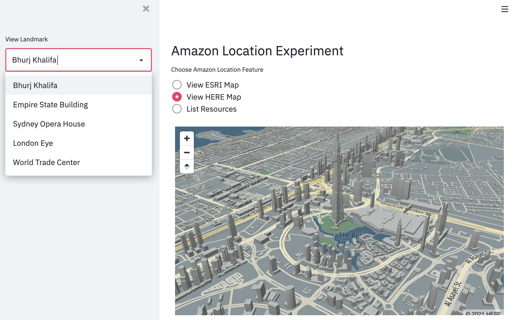
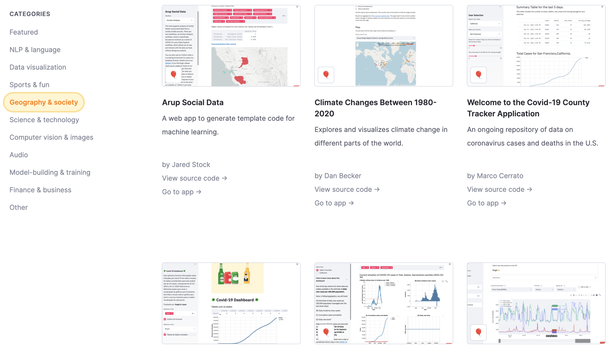
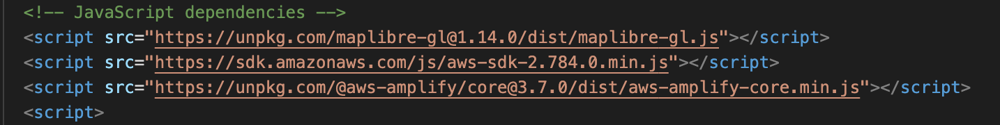
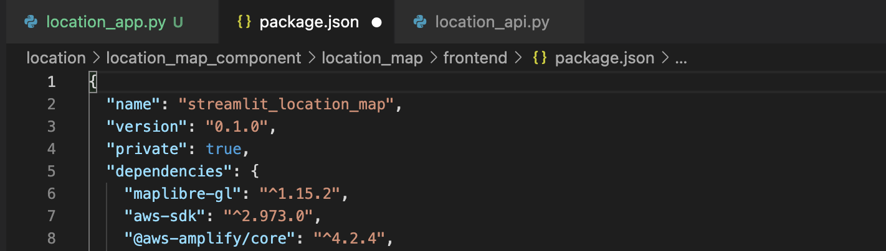

# Amazon Location Experiment

This experiment demonstrates Amazon Location Service, creates a Streamlit component for displaying maps created within the service, creates high level API for rapidly experimenting with the service features.

First create your own [Cognito Identity Pool ID](https://docs.aws.amazon.com/cognito/latest/developerguide/identity-pools.html) and replace as value for `_IDENTITY` variable in the `location_app.py` file. Also create a HERE map with the name `2-5D-Map` and a default `explore.map` ESRI map created by the Amazon Location Console Explore tool.

Start the demo by running `streamlit run location_app.py` command in terminal.

  

## Why Streamlit improves developer experience for geospatial apps

We use React for creating a library of reusable, performant, and user friendly components. Our choice of language is JavaScript and TypeScript which enables reusability across NPM repository of 1.3 million packages (Apr 2020). We wrap these React components using [Streamlit](https://streamlit.io/) - an open-source app framework for Machine Learning and Data Science teams. Streamlit promises to help builders create beautiful data apps in hours, not weeks, all in pure Python. The end result is a live and low-coding experience. As builders add few lines of code, the results are displayed live in the rendered app. Using Python gives access to more than 300,000 packages on PyPI registry, including popular geospatial, data science, and machine learning frameworks (July 2021). Python also enables use of AWS SDK for Python (Boto3) which provides well-designed, efficient abstractions to access AWS Cloud services include Amazon Location with just a few lines of code. Streamlit also integrates with popular data science tools and rapid ML frameworks, which in turn work well for geospatial data and analytics use cases. Streamlit environment can be [hosted on AWS](https://aws.amazon.com/blogs/opensource/using-streamlit-to-build-an-interactive-dashboard-for-data-analysis-on-aws/) and apps can run as mobile web clients.

  

When combined with an interactive notebook experience, Streamlit provides a compelling developer experience as showcased within their community contributed [apps gallery](https://streamlit.io/gallery).

## How does Streamlit provide low-code experience over plain JavaScript

Bundle dependencies as NPM packages version-managed within package.json instead of explicitly loading resources at runtime. 

HTML JS sample loads resources at runtime within browser increasing load time for the app.

  

Packaged dependencies can be optimised for distribution during build stage.

  

Reduce lines of code to use Amazon Location features. The current HTML sample using AWS JavaScript SDK requires 88 lines of code for rendering a map. Cloud Experiments low-code notebook only requires one line of code to achieve the same results.

```python
location_map("2-5D-Map", lon=55.2744, lat=25.1972, zoom=14, pitch=60, identity=_IDENTITY)
```

Following example of Cloud Experiments replicates many features of Amazon Location Console Explorer including listing resources and displaying variety of maps within 20 lines of code.

```python
import streamlit as st
import location_api as loc
from location_map_component.location_map import location_map

_IDENTITY = "replace-with-your-cognito-identity-pool-id"

st.header('Amazon Location Experiment')

tabs = st.radio('Choose Amazon Location Feature', 
    ('View ESRI Map', 'View HERE Map', 'List Resources'))

if tabs == 'View ESRI Map':
    location_map("explore.map", identity=_IDENTITY)

if tabs == 'View HERE Map':
    location_map("2-5D-Map", lon=55.2744, lat=25.1972, zoom=14, pitch=60, identity=_IDENTITY)

if tabs == 'List Resources':
    loc.list_resources()
```

This is achieved by abstracting APIs at three levels. First by React component-based development of Maplibre features. Second by using low-code Streamlit API for data apps development. Third by writing higher order APIs on top of Streamlit. The result is a domain-driven language specific to location use cases which can be ideal for building rapid prototypes, performing exploratory data analysis, and live-coding sessions engaging multi-disciplinary teams productively.