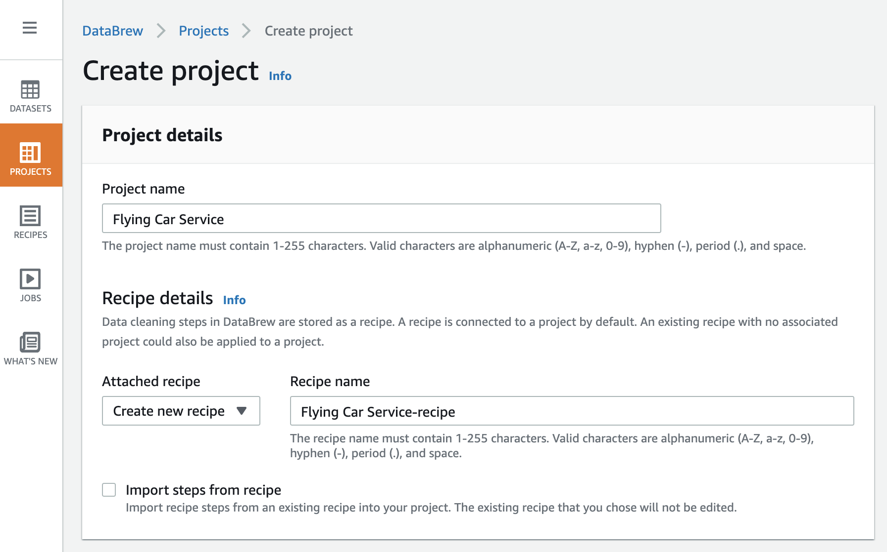
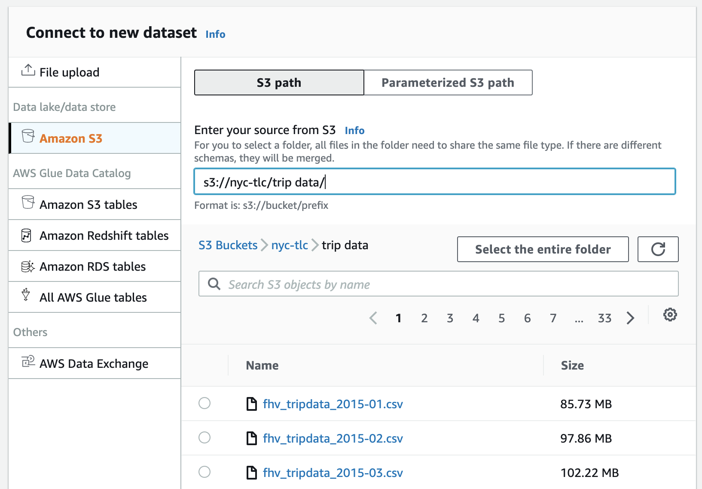
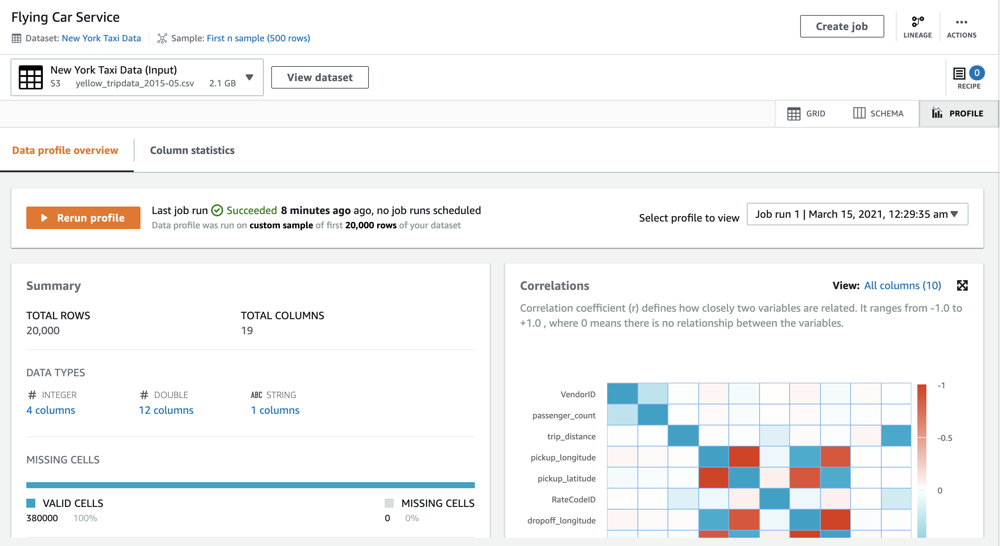
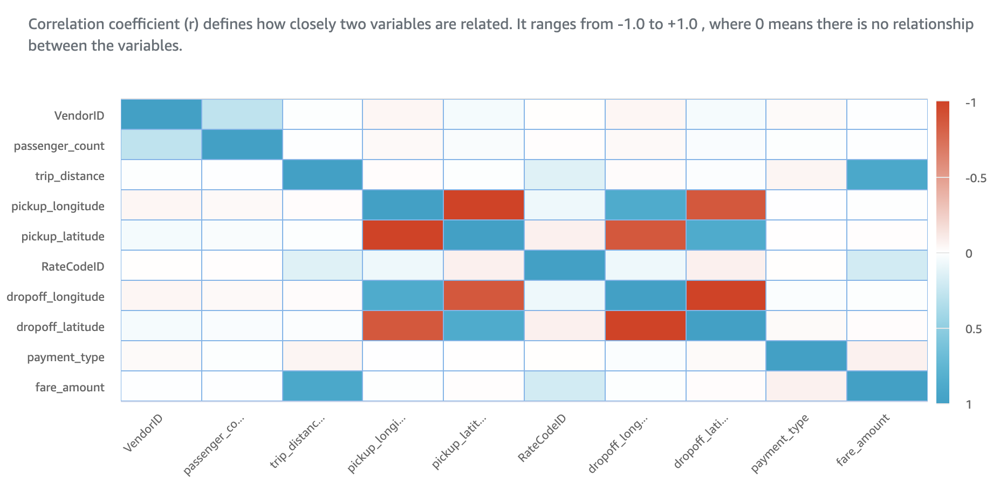
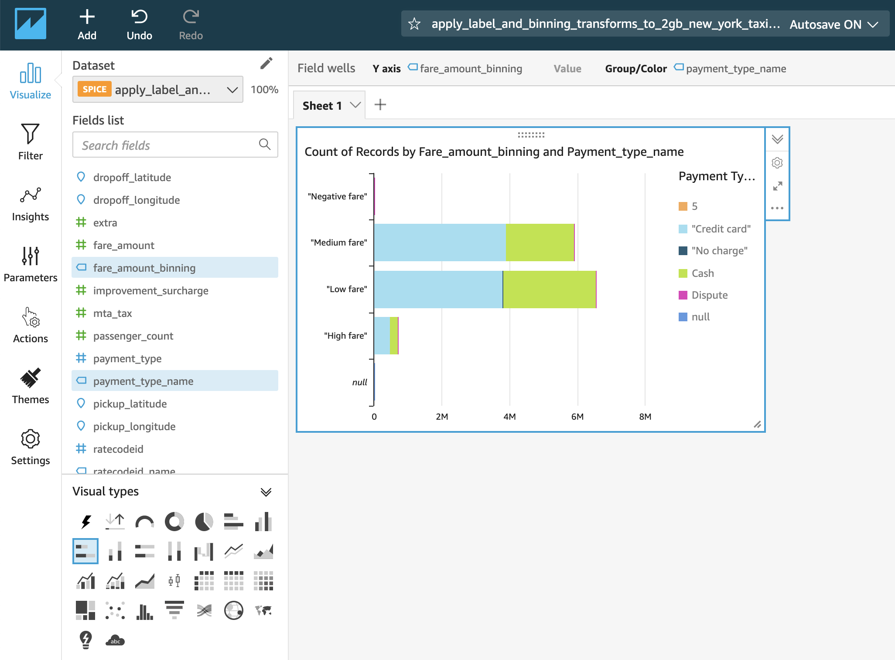
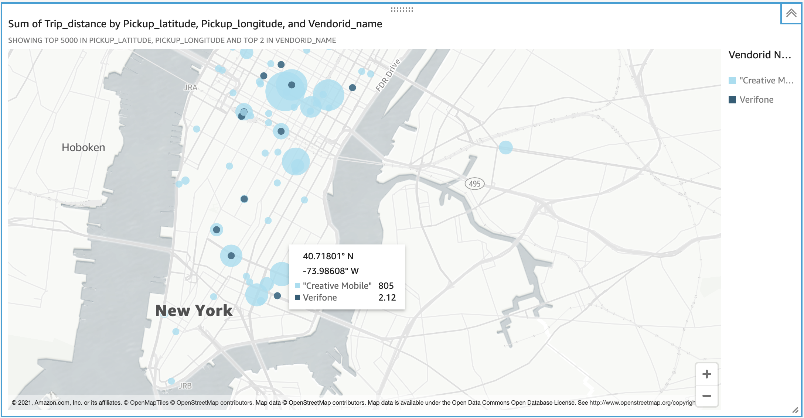

# Flying Cars with Glue DataBrew


Smarter cities will have smarter transportation including multi-modal, eco-friendly, balancing commuter convenience with safety and social distancing. This 60 minute experiment uses open data for good and low/no code services provided by AWS to enable insights for business model innovation in smart transport use case. The experiment is intended as a step-by-step guided co-innovation and design workshop along with an AWS specialist. If you are familiar with the pre-requisites specified in the Cloud Experiment Guide (last section of this experiment) then feel free to make this experiment your own.

Let’s say we want to develop a futuristic commuter service using flying cars. We just got a permit to launch in the busy city of New York. We want to start by helping the rush hour commuters and want to identify the busy locations, times, and routes. We want to start by transforming some taxi commuter data to generate insights for our new service.

Data goes through many processes including acquiring data from third-party sources, generating data, transferring data  securely from source to destination, storing data securely and cost effectively, preparing data for analytics and machine learning applications, analysing data, and visualising data. Transforms can be applied to any of these processes as well as to data itself. An example of data transform is converting from one form to another, like from speech audio files to text transcripts, depending on the use case. A process like data preparation using spreadsheets requiring significant manual intervention and subject matter expertise can transform with a purpose built data preparation tool like AWS Glue DataBrew which can automate and speed up several aspects of the process. In fact data and process transforms are intrinsically linked as specialised techniques and tooling evolve. 

 Back to our flying cars experiment, we have just the data source that may help us deliver insights quickly. Let’s make our way to one of the largest open data registries on the planet at registry.opendata.aws and search for our dataset. Type `new york` in the search bar and you will find a link for New York City Taxi and Limousine Commission (TLC) Trip Record Data.

```
https://registry.opendata.aws/nyc-tlc-trip-records-pds/
```

You can browse this dataset in a few ways. You can follow the documentation link to the nyc.gov website and download large (500MB to 1GB) CSV files and make your Excel angry. We will try a more fun and elegant way to get to this data. Let us make a note of where this dataset is stored on a public S3 location. Amazon Simple Storage Service (Amazon S3) is an object storage service. 

You will note a few things on the registry page for the dataset. First the AWS Region where this dataset is store is `us-east-1`  and second is the S3 location of the dataset which is `s3://nyc-tlc` and we are ready to start.

Let us use the AWS Console to create an S3 bucket (or folder, if you prefer) of our own. This is where we will save the results of our data transforms. First let us ensure we are in the same region as the one where the dataset is located. This will make the data transfers really fast.

Now type `S3` in the AWS Console search bar and select the service. Press the `Create bucket` orange button and choose a unique name. We chose our bucket name as `high-velocity-innovation` and yes we were the first ones to do so in the whole wide world (smiles).

Now we search for AWS Glue DataBrew to transform our taxi dataset. AWS Glue DataBrew is a visual data preparation tool that makes it easy for data analysts and data scientists to clean and normalize data to prepare it for analytics and machine learning.

We start by clicking `Create project` orange button. We enter the name of our project and make sure a new recipe drop down is selected by default.



Scrolling down we select New dataset to import a new dataset from the open data registry. As we start typing the location of the dataset we will notice it lists the files contained within this location. Page through the files and pick a relatively large size file to observe the true capabilities of AWS. We select `yellow_tripdata_2015-05.csv` which is more than 2 GB in size.



Scroll all the way to the bottom and select `Create a new role` in the `Role name` dropdown. We chose `hvi` suffix and clicked `Create project` orange button.

Within a few seconds we are greeted by a cool animating progress indicator. AWS Glue DataBrew is loading our dataset and analysing it.


Within another few seconds we are ready to play with our dataset! What just happened? AWS Glue DataBrew just transformed our comma separated values dataset into a project with new metadata. As you scroll horizontally to see all the columns of the dataset, you will notice the analysis graphs and data on top of the grid telling you patterns found in the sample dataset, including most often found values and distribution of the data. Now click on Schema to change view from Grid and notice that DataBrew has figured out the correct datatypes by analysing the data. The source dataset did not contain any metadata about the schema. 


Now click on Profile tab and then click on the `Run data profile` orange button for more magic! Accept the default values for `Job name` and `Custom sample` while typing in the location of the S3 bucket you created earlier. Select the existing IAM role you created earlier. Click on the `Create and run job` orange button. This will take few tens of seconds to a couple of minutes depending on the size of your dataset and sample. Our 2 GB dataset took 5 minutes to complete the data profile job. Once the job in progress is done, you will see the following results.



The most interesting result is a correlation matrix which indicates relationships between variables in our data. Positive  correlation means both variable values rise together and negative means as one increases, the other decreases. This tells us a lot about our dataset. The obvious ones are as `trip_distance` increases there is a strong positive correlation that `fare_amount` also increases. What is not so obvious is some correlation between `fare_amount` and `payment_type` which maybe indicating that passenger prefer cash for small amounts and cards to larger sums.



There are many other transformations you can apply to the dataset. As you apply more transforms (DataBrew calls these Recipes) you can track data lineage visually.


The dataset in its present form uses numerical data to represent categories like payment type. This is ideal for training data used in machine learning algorithms. However, for the purpose of manual analysis and more intuitive dashboard creation, we will transform these numerical labels to meaningful values. The data dictionaries are available at nyc.gov website. We will lookup the Yellow Taxi data dictionary.

Let us find out why there is a correlation between payment type and fare amount. The data dictionary specifies payment types for each numerical value in our dataset. DataBrew helps us create transforms (Recipes) on our dataset to make these changes a breeze. Let us head back to our project. Click on the Recipe icon and then the `Add step` orange button. Use the `Find step` search to select `Create duplicate column` and then select source as `payment_type` and duplicate column name as `payment_type_name` before clicking `Apply` orange button. Not we click the column icon on top of the grid viewer and change type of the newly created column to string. Now we can add another step in our recipe to `Replace value or pattern` and change numerical values to matching strings from the data dictionary. So number 2 becomes Cash according to the data dictionary. Repeat this for all the distinct values found in the sample data. You may notice that your sample of first n rows may not have all the payment types. You can resample your data by clicking on the Sample link just below the title of your project on top left and selecting a larger random sample. Check the distribution of column values again and add more recipe steps as required. Note that it is possible that the particular trip data file you selected does not have all possible variations of values from the data dictionary. The transformed dataset delivers new insights that customers mostly pay by credit card (>60%) followed by cash (>37%). There are very few instances of No charge or Dispute in this dataset. You can resample another random set to see if these insights change. The recipe will reapply to the new sample within a few seconds after loading it in the viewer. The grayed out Publish icon will become active when recipe is applied to the new sample. Easy! You can also publish and version this recipe for future changes. We can continue applying the data dictionary to Vendor ID and Rate Code fields.


You can also transform existing data to create new data. Right click on the triple-dots icon next to column name for fare_amount and choose `Binning data` transform to create fare_amount_binning column which groups values into bins by high, medium, low fares.


Once we are happy with these transforms on the random sample we can get ready to apply these on the entire 2 GB dataset. First we publish another version of the recipe. Next we click on the orange Recipes icon in the left menu bar. Select the recently published recipe. Now we click `Create job with this recipe` button. Choose the project we just created to apply the recipe to the entire attached dataset for this project. When specifying the Job output settings you can choose to compress the output to gzip format. This will save space on our local S3 and also is an acceptable format for the next step, which is to take this data into QuickSight for building dashboards. Select the IAM role you created earlier. Hit the `Create and run job` orange button and wait patiently for the job to complete. In our case, this job will apply all 18 steps transformation recipe to millions of rows of our 2 GB dataset. We grab a cuppa coffee and stretch our legs for a few minutes. Our job took 11 minutes to complete and we could click on the output to see a compressed gzip 560 MB file on S3. We are ready for the next step in building our Flying Car service of the future!

We will now use AWS Glue to prepare our dataset for analytics. Once in Glue console, add a new database. We called ours `hvi` and then went on to select Tables under the Database menu and chose to Add tables using a crawler. The notion of database and tables in Glue refers to metadata. There is no physical database created for you to manage. The source data still sits in your S3 gzipped file. Configure the crawler with following settings and run it.


The crawler completes extracting the metadata within a few seconds and creates a new table pointing to the data on S3. Now make your way to Amazon Athena, an interactive query service that makes it easy to analyze data in Amazon S3 using standard SQL. Choose the database you just created from the dropdown on left sidebar, select the table created by the Glue crawler. You can click on the vertical-dots menu next to the table name and select `Preview table` menu. This creates a Structured Query Language (SQL) statement to return the first 10 rows of your data straight from S3 gzipped CSV file. Cool, you did not actually created a physical database which is normally required to run SQL.

Next we will analyse and visualise our dataset using Amazon QuickSight - a scalable, serverless, embeddable, machine learning-powered business intelligence (BI) service built for the cloud. We search the AWS Console for QuickSight and launch the service in our browser. Click the `New analysis` blue button on top right. Next click `New dataset` and choose Athena as a data source. Select your data source and move the next step to create the analysis. As QuickSight loads the dataset for the first time (subsequent loads are much faster) you will notice there are more than 13 Million records of data in our original 2 GB dataset. To create your first visualisation let us analyse the hypothesis we made earlier on correlation observed between fare amount and payment type. Select `payment_type_name` field and `fare_amoung_binning` field to see the chart. As you change the cart type to stacked bar chart you can notice the correlation that cash payments are higher ratio to credit cards for low fare, lower for medium fare, and lowest for high fare. We just transformed insights from raw data. Can we build our Flying Car service now please!



We should gain more insights on our data before creating our business plan. Add another visual clicking the plus icon on top left menu. Now select the pickup latitude and longitude fields. Select the Points on map chart, pan, and zoom into New York. Next select trip distance and vendor fields. This single visual tells us most revenue making pickup hotspots we need to serve and competing vendors for our Flying Car service!



What did we achieve so far? We started with 13 million records across 20 attributes or 260 million individual data points which are not humanly conceivable to analyse and find higher order patterns. We ended up with a geo-spatial drill-down visualisation which provided key insights for our problem space. We did not have to write a single line of code during the journey. We did not provision or configure any virtual servers on Cloud as we used serverless capabilities of Glue, Athena, and QuickSight. We did not have to setup or create a database. We could develop 18 data transforms and several visualisation transforms on our dataset using intuitive no/low code tools. All these capabilities gave us tremendous speed over doing this process using traditional development environments or spreadsheets. This results in high velocity decision making when innovating our business model.


Leaving this experiment with an assignment for you. Study the pie charts here in conjunction with the map visualisation. Do note that the legend colors for vendors are switched between map and pie charts. Answer this question - which vendor will you want to follow as best practice for your Flying Car service and why? Hope you take a high velocity decision!


## Cloud Experiment Guide

Supporting reading material to prepare for this cloud experiment.

**Resources used by this experiment**

Registry of Open Data on AWS, from where we source the New York Taxi dataset, https://registry.opendata.aws/

Yellow Taxi data dictionary, where the New York Taxi data schema (column names) is defined, https://www1.nyc.gov/assets/tlc/downloads/pdf/data_dictionary_trip_records_yellow.pdf

**AWS Services used by this experiment**

AWS Glue, https://aws.amazon.com/glue/

AWS Glue DataBrew, https://aws.amazon.com/glue/features/databrew/

Amazon Athena, https://aws.amazon.com/athena/

**Other References and Citation**

The Fast Fourier Transform mini-story refers data point from book by Ian Stewart on 17 equations that changed the world, https://www.amazon.com/Pursuit-Equations-That-Changed-World/dp/0465085989/

Uber Business Model, explained in detail by FourWeekMBA, https://fourweekmba.com/uber-business-model/


