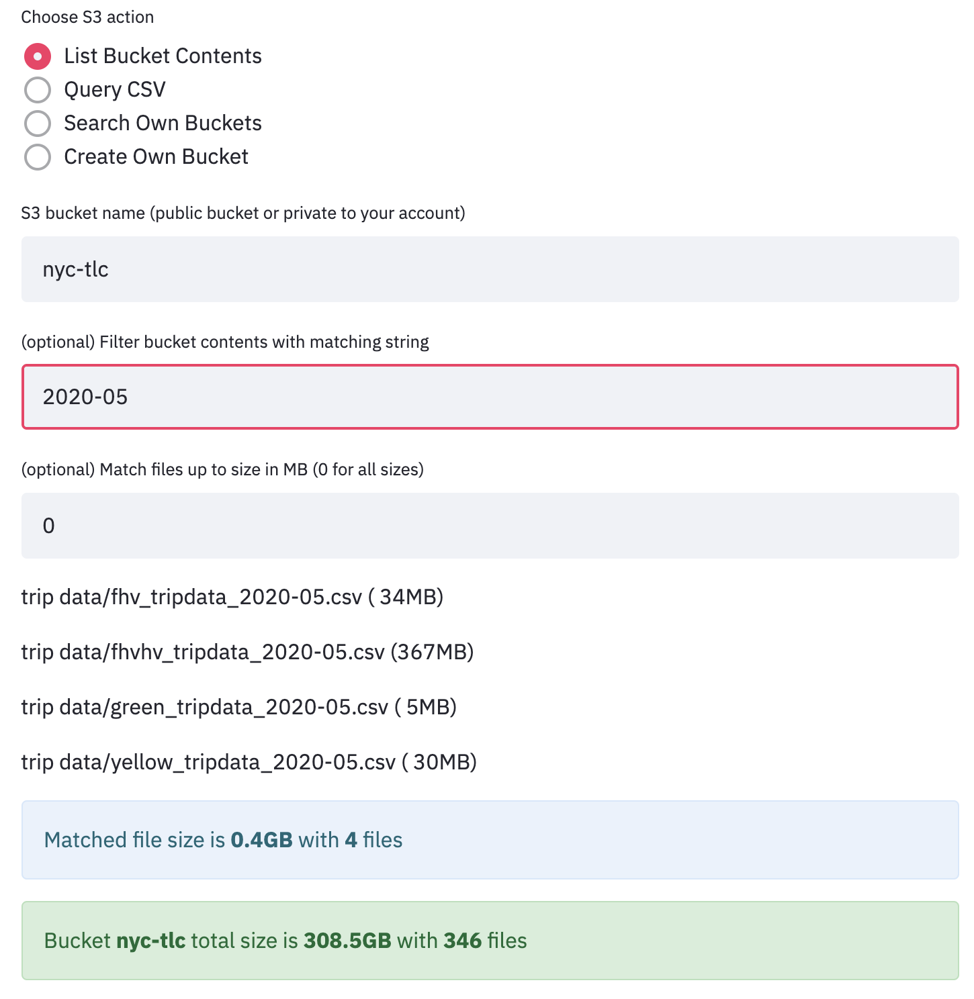
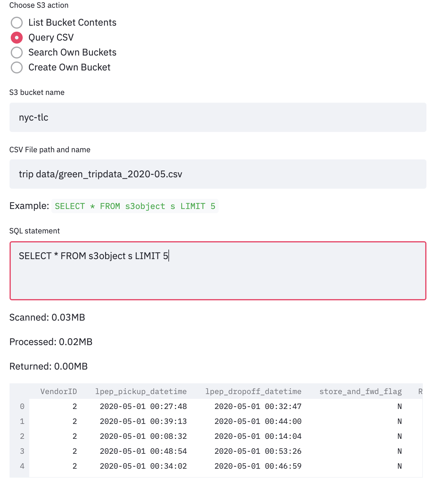

# Open Data Explorer

Apps and API for exploring open data sources including [AWS Registry of Open Data](https://registry.opendata.aws/) which lists datasets for genomics, satellite, transport, COVID, medical imaging, and other use cases in data for social good.

## Amazon S3 App

This experiment provides a starter app and companion API `s3.py` which makes it easy to list and query public S3 buckets for open data. The app also demonstrates how to create and list S3 buckets in your own AWS account.

### List Bucket Contents

Get started by running the app `streamlit run open-data-explorer/s3-app.py` from the repository root folder.

Try the List Bucket Contents feature by typing `nyc-tlc` as the S3 bucket name for accessing the public dataset. Enter `2021-05` to Filter bucket contents with matching string. This will show fewer files in listing, while determining overall size of the public dataset in GB and number of files.

This experiment feature is useful when exploring public datasets and identifying a relatively small sample dataset file for running your experiments, before commiting to a larger dataset. This will save you cost and time in running the cloud experiments.

### Query CSV

Next you can query a public dataset flat file (well-formed CSV) stored in open data registry directly using SQL, without having to import the dataset into a database. This uses AWS [S3 Select](https://docs.aws.amazon.com/AmazonS3/latest/userguide/s3-glacier-select-sql-reference-select.html) feature.

Use the same public dataset bucket `nyc-tlc` and copy paste one of the files listed by the List Bucket Contents feature, like on our case we use `trip data/green_tripdata_2020-05.csv` file. Next we add a SQL statement for the query `SELECT * FROM s3object s LIMIT 5` using the sample provided or creating our own. The query results are displayed along with size of dataset scanned, processed, and returned by the query.